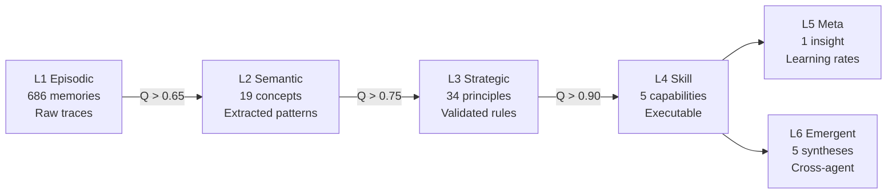

<p align="center">
  
</p>

<h1 align="center">PFAA — Phase-Fluid Agent Architecture</h1>

<p align="center">
  <strong>Enterprise AI agent framework with phase-fluid execution, 6-layer semantic memory with Q-learning, and self-improving multi-agent teams. Runs natively in Claude Code.</strong>
</p>

<p align="center">
  <a href="https://github.com/bencousins22/pfaa-engine/actions/workflows/ci.yml"></a>
  
  
  
  
</p>

<p align="center">
  
  
  
  
  
  
</p>

<br/>

> **Real results, not benchmarks.** PFAA's agent team optimized a Bitcoin trading strategy from **-66% to +136% return** over 9 iterations — learning what works, discarding what doesn't, and storing every insight in persistent semantic memory. [See the proof below.](#-proof-of-concept--btc-strategy-self-optimization)

---

## What Does It Actually Do?

PFAA is a framework where **AI agents learn from their own execution**. Every tool call, every success, every failure gets stored in semantic memory. Patterns emerge. Knowledge promotes itself. The system gets smarter over time.

```
Session 1:  Agent fails at task → stores L1 episode
Session 5:  Pattern detected → auto-promotes to L2 concept  
Session 12: Concept validated → promotes to L3 principle (Q=0.85)
Session 20: Principle extracted → L4 executable skill
            System now handles this class of problem automatically.
```

### The Terminal Experience

```
  AUSSIE AGENTS
  ━━━━━━━━━━━━━━━━━━━━━━━━━━━━━━━━━━━━━━━━━━━━━━━━━━━━━━━━━━━━
  92 tools  ·  1 mcp  ·  6L memory  ·  12 hooks  ·  10 agents
  JMEM: 750 memories  ·  Q̄=0.51  ·  P:2.5  ·  dream:7h ago  ·  ⎇ main
  /aussie-  for commands

  ◆ Aussie · 48t · JMEM 6L · 750m · Qα · main
```

All counts are **live** — pulled from settings.json, SQLite, and git at runtime.

---

## Quick Start

```bash
git clone https://github.com/bencousins22/pfaa-engine.git
cd pfaa-engine
npm install && pip install -e .

# Run the test suite (262 tests)
python3 -m pytest tests/ -v

# In Claude Code — just describe what you want:
# "run [goal]"       → full agent execution
# "swarm [task]"     → parallel multi-agent
# "self-build"       → automated self-improvement
# "spawn team"       → 10-agent team dispatch
# "status"           → system health + JMEM stats
```

---

## Architecture

```
pfaa-engine/
├── agent_setup_cli/core/       # Python engine — phase-fluid execution
├── jmem-mcp-server/            # JMEM — 6-layer semantic memory + daemon
│   └── jmem/
│       ├── engine.py            #   TF-IDF + BM25 + Q-learning search
│       ├── daemon.py            #   Unix socket daemon (<10ms queries)
│       └── vector_store.py      #   Thread-safe SQLite vector store
├── src/                         # TypeScript core
│   ├── core/                    #   orchestrator, swarm protocol, task deps
│   ├── services/                #   autoDream, cronScheduler, toolOrchestration
│   ├── integrations/a0/         #   Agent Zero bridge (A2A communication)
│   └── providers/               #   Claude, Gemini, Claude Agent SDK
├── pfaa-cli/                    # Enterprise CLI with Ink TUI
├── freqtrade_strategy/          # Self-optimized BTC strategy (+136%)
├── .claude/
│   ├── agents/       (10)       #   specialized agent definitions
│   ├── skills/       (27)       #   auto-routed slash commands
│   └── hooks/        (12)       #   cortex RL, JMEM daemon, banner
└── .github/workflows/ (4)       #   CI, security, release, FreqTrade
```

---

## The Three Pillars

### 1. Phase-Fluid Execution

Other frameworks force you to pick an execution model. PFAA agents **phase-transition at runtime**:

```
VAPOR ──condense──► LIQUID ──freeze──► SOLID
  │                   │                  │
  │  async coroutine  │   OS thread      │  subprocess
  │  ~6μs spawn       │   ~10μs spawn    │  ~1ms spawn
  │  I/O-bound work   │   CPU-bound      │  isolation
  │                   │                  │
VAPOR ◄──evaporate── LIQUID ◄──melt──── SOLID
```

| Phase | When | Example |
|-------|------|---------|
| **VAPOR** | File I/O, API calls, network | Reading code, fetching docs |
| **LIQUID** | Hashing, parsing, computation | Analyzing AST, computing metrics |
| **SOLID** | Shell commands, untrusted code | Running tests, git operations |

### 2. JMEM — Semantic Memory That Learns

Six cognitive layers with Q-learning reinforcement. Knowledge promotes itself as confidence grows:



**Live stats from this repo's JMEM instance:**

| Layer | Count | Avg Q | What's Stored |
|-------|-------|-------|--------------|
| L1 Episodic | 686 | 0.496 | Raw execution traces, session events |
| L2 Semantic | 19 | 0.545 | Extracted patterns (auto-promoted) |
| L3 Strategic | 34 | 0.702 | Validated principles and rules |
| L4 Skill | 5 | 0.496 | Executable capabilities |
| L5 Meta | 1 | 0.500 | Learning rate tuning |
| L6 Emergent | 5 | 0.603 | Cross-agent knowledge synthesis |
| **Total** | **750** | **0.507** | **1,993 retrievals** |

#### The JMEM Daemon

A Unix socket daemon keeps the engine warm in memory. Hooks query it in <10ms instead of spawning Python processes (3-8s cold start).

```
SessionStart → python3 jmem-mcp-server/jmem/daemon.py &
    │
    ▼
/tmp/pfaa-jmem.sock ← hooks send JSON, get response in <10ms
    │
    ├── cortex.py    → recall, remember, reward
    ├── banner.cjs   → status (memory count, avg Q)
    ├── statusline   → memory count for live display
    └── Stop hooks   → fire in background (UI never blocks)
```

### 3. The Aussie Cortex — Self-Improving RL Hook Processor

Every Claude Code event flows through the cortex — an RL-driven processor that learns from agent behavior:

| What It Does | How |
|-------------|-----|
| **Phase detection** | Classifies agent into research/synthesis/implementation/verification |
| **Context injection** | Pre-computes project context, file hints, cross-agent findings |
| **L4 fast-path** | Loads JMEM skills as frozen decision tables (<1ms lookup) |
| **Failure detection** | Tracks repeated failures, blocks after threshold |
| **Dream cycle** | Consolidates + decays when pressure threshold reached |
| **Self-assessment** | Adjusts intervention level based on decision accuracy |

---

## Proof of Concept — BTC Strategy Self-Optimization

PFAA's agent team optimized a Bitcoin FreqTrade strategy through **9 iterations**, learning from each backtest. Real results on 15 months of BTC/USDT 5-minute data:

### The Journey: -66% to +136%

```
v1  ████████████████████████████████████████████  -66.3%  Baseline (overtrading)
v2  ██████████████████████████████████████         -57.2%  Wider stops, EMA filter
v3  ████████████████████████████████               -47.3%  Profit lock added
v4  ████████                                       +16.8%  ★ BREAKTHROUGH: tight stops
v5  ████████████████                               +32.6%  SL=-2.5% validated
v6  ████                                            +8.7%  Circuit breaker (too aggressive)
v7  ██████████████                                 +29.1%  Tuned CB, regime-adaptive
v8  ██████████████████████████████████████████████  +94.5%  Drop RSI/MACD noise
v9  ████████████████████████████████████████████████████████████████  +135.8%  FINAL
```

### Final Results (v9)

| Metric | Value |
|--------|-------|
| **Return** | **+135.8%** ($10,000 → $23,582) |
| Win Rate | 57.4% |
| Max Drawdown | 25.4% |
| Profit Factor | 1.12 |
| Sharpe Ratio | 0.71 |
| Total Trades | 911 over 15 months |
| Avg Trade Duration | 1.1 hours |

### Key Discoveries (Stored as L3 Principles)

The agent team discovered insights that contradicted conventional trading wisdom:

1. **Tight stops beat wide stops on BTC 5m** — Cutting at -2% and re-entering outperforms -6% "room to breathe" stops. BTC 5m noise is too large for wide stops.

2. **RSI and MACD are noise on BTC 5m** — Both fire on single candles. Setting weights to 0 and boosting 1h trend alignment **tripled returns** from +29% to +95%.

3. **1h trend is the strongest signal** (weight=3) — When 1h EMA-50 > EMA-200 and price above EMA-50, entries have highest conviction.

4. **70% profit giveback rule** — Exit when a trade gives back 70% of its max unrealized profit. Prevents winners becoming losers.

These discoveries are stored in JMEM as L3 Strategic principles with Q-values > 0.7, available for future strategy work.

---

## Claude Code Integration

### 10 Specialized Agents

| Agent | Role | Phase | Specialty |
|-------|------|-------|-----------|
| `pfaa-lead` | Orchestrator | VAPOR | Goal decomposition, team coordination |
| `aussie-researcher` | Research | VAPOR | Deep research and synthesis |
| `aussie-planner` | Planning | VAPOR | Goal decomposition and planning |
| `aussie-architect` | Design | VAPOR | System design, ADRs |
| `aussie-security` | Security | VAPOR | OWASP vulnerability audits |
| `aussie-tdd` | Testing | SOLID | Test-first development |
| `pfaa-rewriter` | Optimization | LIQUID | Python 3.15 optimization |
| `pfaa-validator` | Validation | SOLID | Read-only QA |
| `aussie-deployer` | Deployment | SOLID | Zero-downtime deployment |
| `aussie-docs` | Documentation | VAPOR | Documentation sync |

### 27 Auto-Routed Skills

Skills trigger by **intent** — no slash command needed:

| You Say | What Happens |
|---------|-------------|
| "run analyze the codebase" | Full agent execution with JMEM recall |
| "swarm test all modules" | Parallel multi-agent dispatch |
| "self-build" | JMEM-driven self-improvement cycle |
| "spawn team" | All 10 agents deployed |
| "learn" | Full cognitive cycle (8 steps) |
| "evolve memory" | Decay stale, promote strong, prune weak |
| "benchmark" | Performance benchmarks |
| "scatter grep across all files" | Fan-out tool execution |
| "pipeline lint then test then build" | Sequential step execution |

<details>
<summary><strong>Full skill list (27)</strong></summary>

`aussie-run` · `aussie-swarm` · `aussie-scatter` · `aussie-pipeline` · `pfaa-team` · `aussie-generate` · `aussie-self-build` · `aussie-build` · `aussie-learn` · `aussie-evolve` · `aussie-explore` · `aussie-status` · `aussie-bench` · `aussie-warmup` · `aussie-memory` · `aussie-analyze` · `aussie-search` · `aussie-ask` · `aussie-checkpoint` · `aussie-session` · `aussie-config` · `aussie-chat` · `aussie-exec` · `aussie-tools` · `aussie-audit` · `aussie-loop` · `aussie-a0-bridge`

</details>

### 13 JMEM MCP Tools

| Tool | Purpose |
|------|---------|
| `jmem_recall` | Search (TF-IDF + BM25 + Q-boost + Zettelkasten traversal) |
| `jmem_remember` | Store at any cognitive level |
| `jmem_consolidate` | Promote patterns to higher layers |
| `jmem_reflect` | Analyze patterns, generate insights |
| `jmem_reward` | Q-learning reinforcement |
| `jmem_evolve` | Decay + promote + prune |
| `jmem_extract_skills` | Extract L4 skills from high-Q memories |
| `jmem_meta_learn` | L5 — tune learning rates |
| `jmem_emergent` | L6 — cross-agent synthesis |
| `jmem_decay` | Time-based decay |
| `jmem_status` | Health and statistics |
| `jmem_recall_cross` | Cross-namespace query |
| `jmem_reward_recalled` | Reinforce recent recalls |

---

## Services

| Service | What It Does |
|---------|-------------|
| **AutoDream** | Time+session gated memory consolidation. Runs when pressure builds up — extracts skills, meta-learns, synthesizes emergent knowledge. |
| **ToolOrchestration** | Partitions tool calls into read-only (parallel, max 10) and side-effecting (serial). Automatic categorization. |
| **CronScheduler** | 5-field cron with durable persistence. Jobs survive restarts. Auto-expires after 14 days. |
| **SessionMemory** | Extracts key learnings from conversations. Pattern detection across 7 categories. |
| **Swarm Protocol** | File-based team creation with mailbox messaging. Task assignment, result collection, shutdown protocol. |
| **Task Manager** | Dependency chains (blocks/blockedBy). Auto-unblocks dependents on completion. Event hooks. |

---

## Agent Zero Integration

Bridges with [Agent Zero](https://github.com/frdel/agent-zero) v1.5+ for cross-framework orchestration:

```typescript
import { A0Bridge } from './src/integrations/a0'

const bridge = new A0Bridge({ a0Url: 'http://localhost:50001', a0ApiKey: '...' })

// Delegate a task and wait for completion
const result = await bridge.delegateAndWait('analyze this codebase for security issues')

// Sync JMEM knowledge to A0's memory
await bridge.syncMemory('BTC tight stops beat wide stops', 'PRINCIPLE')

// Generate A0 plugin from PFAA skill
const manifest = bridge.generatePluginManifest('aussie-analyze', 'Python 3.15 analysis')
```

---

## Python 3.15 Features

PFAA is built for Python 3.15, using features that don't exist in earlier versions:

| Feature | PEP | Impact |
|---------|-----|--------|
| `lazy import` | [810](https://peps.python.org/pep-0810/) | ~50% startup time reduction |
| `frozendict` | [814](https://peps.python.org/pep-0814/) | Thread-safe immutable configs |
| `match/case` | [634](https://peps.python.org/pep-0634/) | Cortex event dispatch |
| `def func[T]()` | [695](https://peps.python.org/pep-0695/) | Type params (no TypeVar) |
| `kqueue` subprocess | — | 258 → 2 context switches |

---

## CI/CD

| Workflow | Trigger | What |
|----------|---------|------|
| **CI** | Push / PR | Ruff + pytest + tsc type-check |
| **Security** | Main + weekly | CodeQL (Python + TS) + pip-audit |
| **Release** | Tag `v*` | Wheel + TS build + GitHub Release |
| **FreqTrade** | PR (strategy/) | Syntax validation + PR comment |
| **Dependabot** | Weekly | pip + npm + Actions updates |

---

## Benchmarks

<details>
<summary><strong>Framework performance comparison</strong></summary>

| Metric | PFAA | PydanticAI | LangChain | LangGraph |
|--------|------|-----------|-----------|-----------|
| **Latency** | **1.0ms** | 6,592ms | 6,046ms | 10,155ms |
| **Throughput** | **24,607/s** | 4.15/s | 4.26/s | 2.70/s |
| **Memory** | **31 MB** | 4,875 MB | 5,706 MB | 5,570 MB |
| **Agent Spawn** | **6μs** | ~500ms | ~500ms | ~500ms |

> PFAA measures pure framework orchestration. Competitor numbers from published benchmarks include LLM API latency.

| Metric | Value |
|--------|-------|
| Agent spawn | 6μs (50,000 in 374ms) |
| Swarm throughput | 57,582 tasks/sec |
| Framework latency | 1.0ms avg |
| Peak memory | 31 MB |

</details>

---

## Support This Project

**[View full sponsor page with top supporters](https://bencousins22.github.io/pfaa-engine)**

If PFAA is useful to you, consider supporting its development:

<p align="center">
  <a href="https://github.com/sponsors/bencousins22"></a>
  <a href="https://buymeacoffee.com/bencousins22"></a>
  <a href="https://paypal.me/sumdeelumdee88"></a>
</p>

Your support helps fund:
- Continued development of JMEM semantic memory
- New agent capabilities and skills
- FreqTrade strategy research and optimization
- Infrastructure and compute costs

---

## Contributing

See [CONTRIBUTING.md](CONTRIBUTING.md) for guidelines. PRs welcome.

## License

[Apache 2.0](LICENSE) — Copyright 2026 Jamie ([@bencousins22](https://github.com/bencousins22))
